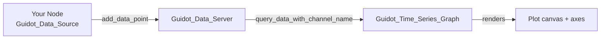

# Data Flow

## Architecture



Every frame the graph queries the server for buffered data points on all subscribed channels and redraws the plot.

## Key classes

### Guidot_Data

A lightweight descriptor for one data stream. Create one per signal you want to plot.

```gdscript
var my_channel: Guidot_Data = Guidot_Data.new()
my_channel.set_name("engine_rpm")
```

### Guidot_Data_Source

Attach this node to whatever scene node produces data. It auto-discovers the nearest `Guidot_Data_Server` on `_ready`.

```gdscript
# Register a channel
_client.register_data_channel(my_channel)
_client.update_server()

# Push a value (call each frame or on event)
_client.add_data_point(my_channel, current_rpm)
```

**Update rate cap:** The client is capped at 60 Hz (Godot's default process rate). Calls above 60 Hz are silently clamped.

### Guidot_Data_Group

Group related channels so the wizard's subscriber list stays organised.

```gdscript
var motion_group: Guidot_Data_Group = Guidot_Data_Group.new()
motion_group.set_name("Motion")
motion_group.add_channel(velocity_x_channel)
motion_group.add_channel(velocity_y_channel)

_client.register_data_group(motion_group)
_client.update_server()
```

Channels inside a group are shown under a collapsible header in the wizard.

### Guidot_Data_Server

You normally do not call this directly — the client and graph handle it. Place one instance in your scene tree and everything else auto-connects to it.

## Lifecycle

```
_ready()
  └─ Guidot_Data_Source scans for Guidot_Data_Server
  └─ registers itself as a client
  └─ you call register_data_channel / register_data_group
  └─ call update_server() to flush channel registrations

_process()
  └─ call add_data_point() with your values
  └─ server buffers the point
  └─ graph queries server and redraws
```
